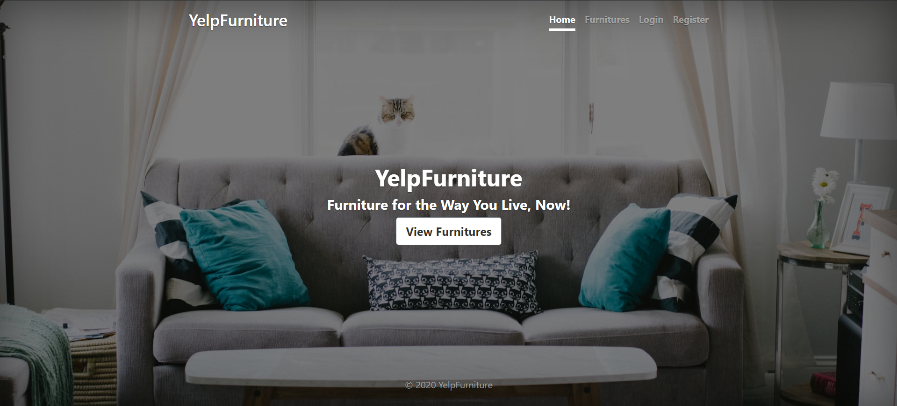
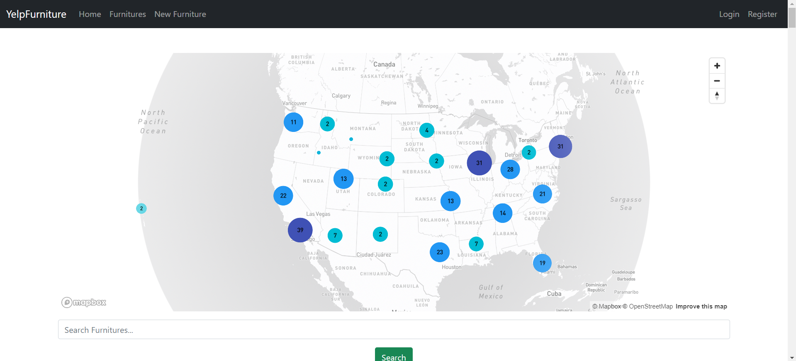
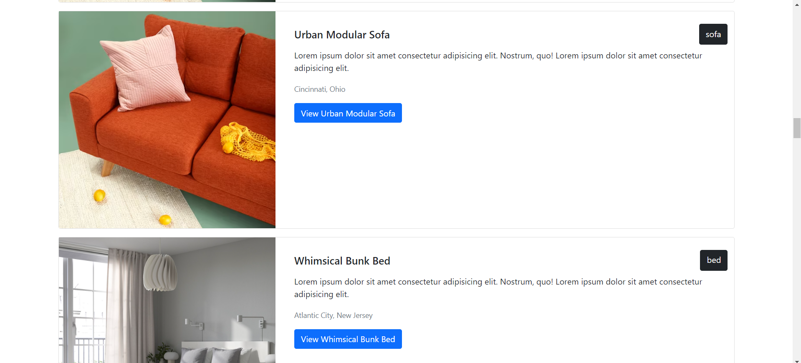
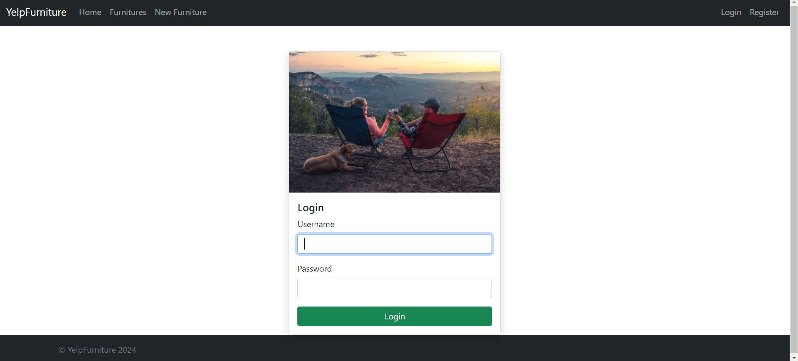
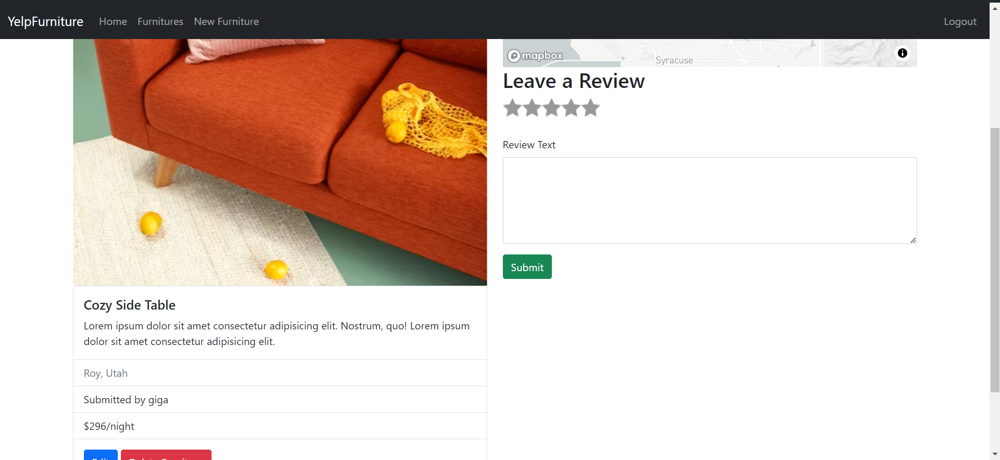
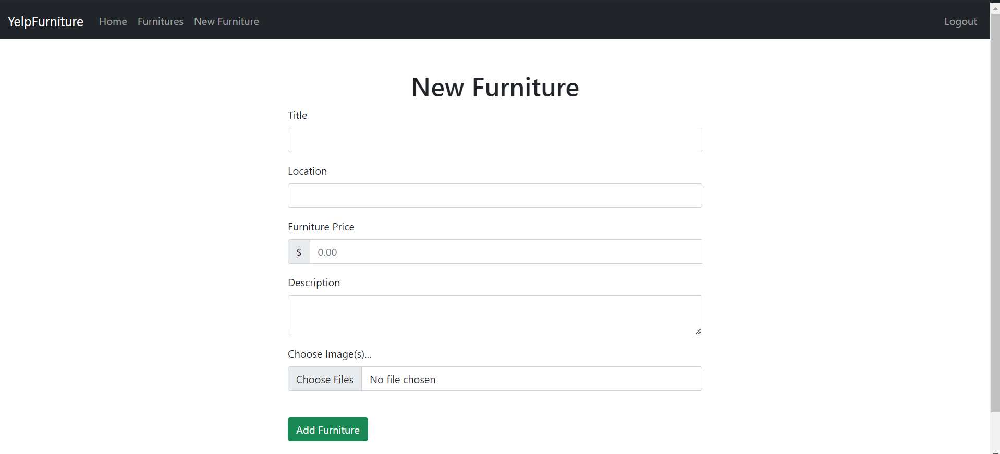

# Furniture Renting System

## Description

This is a furniture renting system that allows users to rent furniture for a certain period of time. The system is designed to be user-friendly and easy to use. Users can browse through the available furniture, select the items they want to rent, and make a reservation. They can also view their reservation history and write reviews for the furniture they have rented. The system also provides a map view of the furniture locations, so users can easily find the furniture they are looking for.

## Features

- login and register
- authorization
- Browse through available furniture
- Select items to rent
- Make a reservation
- View reservation history
- Map view of furniture locations
- Add furniture to rental list
- write a review for furniture
- filter furnitures according to your neeeds with pagination enbaled

## Screenshots

## Technologies Used

- Javascript
- Express.js
- Node.js
- MongoDB

## Installation

1. Clone the repository
2. Install the dependencies using `npm install`
3. Start the server using `npm run dev`

